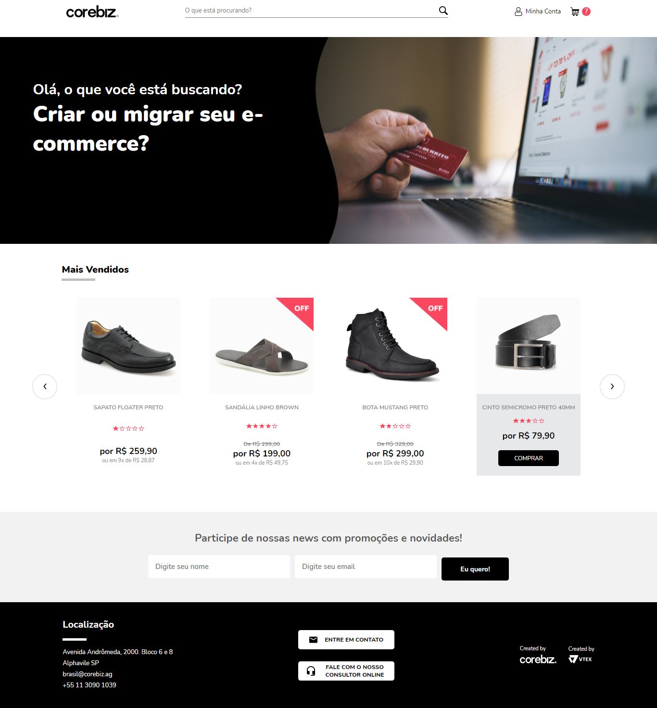

<h1 align="center">
    Corebiz Challenge (2021)
</h1>
O projeto consiste em criar uma Single Page Application (SPA) de e-commerce, consumindo uma API de produtos para exibição na vitrine e, uma API de newsletter para captura de dados (nome e e-mail).


[TOC]


---

#### 👀 Preview


<h1 align="center">
    
</h1>


---

#### 🛠 Tecnologias e Recursos 

- [x] HTML5, CSS3, Javascript
- [x] ReactJS (Styled Components, UseState, UseEffect)
- [x] Axios
- [x] Webpack, Webpack Dev Server e Babel
- [x] Clean Webpack Plugin, HTML Webpack Plugin
- [x] React Fast Refresh
- [x] React Elastic Carousel
- [x] React Router DOM
- [x] Local Storage


---

#### ✨ Funcionalidades

- [x]  Layout responsivo
- [ ]  Menu na versão mobile
- [x]  Pegar os dados dos produtos e construir uma vitrine através de uma API utilizando `axios`
- [x]  Exibição desse dados da API utilizando o método `map()` para percorrer e listar os elementos conforme a aplicação
- [x]  Ao clicar no botão "Comprar" deve ser incrementada a quantidade de itens no carrinho, persistindo mesmo depois da atualização da página
- [x]  Formulário de contato com validações dos campos (se o e-mail for inválido ou o nome estiver vazio) e envio dos dados (nome e e-mail) para a API de Newsletter
- [x]  Exibição dos produtos em carrosel


----

#### 🎨 Wireframe

A representação visual da página está disponível no Figma:

https://www.figma.com/file/awhTJyKgrjEOqPHUrrFBv0/Corebiz---Frontend-Challenge?node-id=0%3A1


---

#### 🚀 Deploy da Aplicação

Feito deploy da aplicação no Heroku:


---

#### 💻 Como executar o projeto

##### Pré-requisitos

Antes de começar, você vai precisar ter instalado em sua máquina as seguintes ferramentas:
[Git](https://git-scm.com), [Node.js](https://nodejs.org/en/)
Além disto, é bom ter um editor para trabalhar com o código como [VSCode](https://code.visualstudio.com/)

##### 🧭 Rodando a aplicação web (Frontend)

```bash

# Clone este repositório
$ git clone https://github.com/cvscaminha/Challenge-Corebiz.git

# Acesse a pasta do projeto no seu terminal/cmd
$ cd Challenge-Corebiz

# Instale o yarn (se ainda não estiver instalado)
$ npm install -g yarn

# Instale as dependências
$ yarn install

# Execute a aplicação no modo de desenvolvimento
$ yarn start

# A aplicação será aberta na porta:3000 - acesse http://localhost:3000
# A página será recarregada se você fizer edições. Você também verá quaisquer erros de lint no console.

# Inicie o executor de teste no modo de observação interativo.
$ yarn test

# Compila o aplicativo para produção na pasta `Dist`.
#Ele agrupa corretamente o React no modo de produçãoe otimiza a construção para o melhor desempenho.
#A compilação é reduzida e os nomes dos arquivos incluem os hashes.
#Seu aplicativo está pronto para ser implantado!
$ yarn build

```


---

#### 💪 Como contribuir no projeto

1. Faça um **fork** do projeto.
2. Crie uma nova branch com as suas alterações: `git checkout -b my-feature`
3. Salve as alterações e crie uma mensagem de commit contando o que você fez: `git commit -m "feature: My new feature"`
4. Envie as suas alterações: `git push origin my-feature`
5. Criar um Pull Request

> Caso tenha alguma dúvida confira este [guia de como contribuir no GitHub](./CONTRIBUTING.md)


---

#### 🦸 Autor

Feito com&ensp;❤️&ensp;por Cristiano V S Caminha&ensp;

[](https://www.linkedin.com/in/cristianocaminha/)


